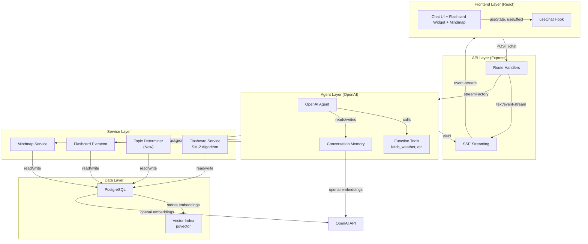
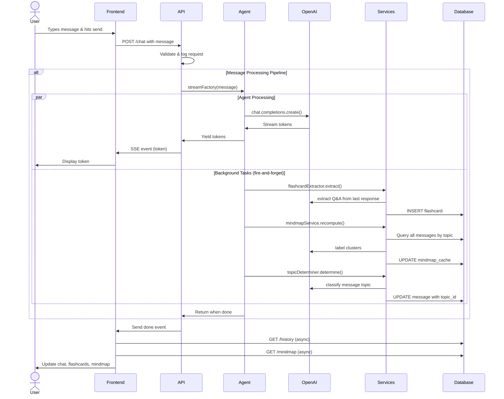
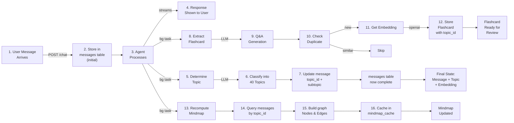
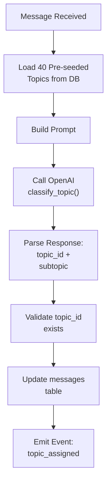
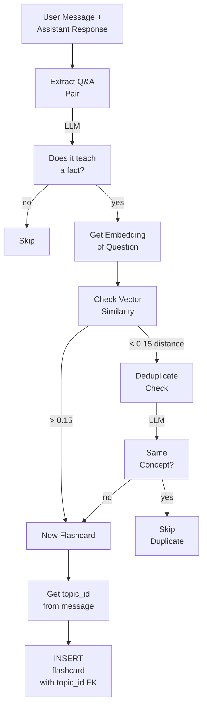
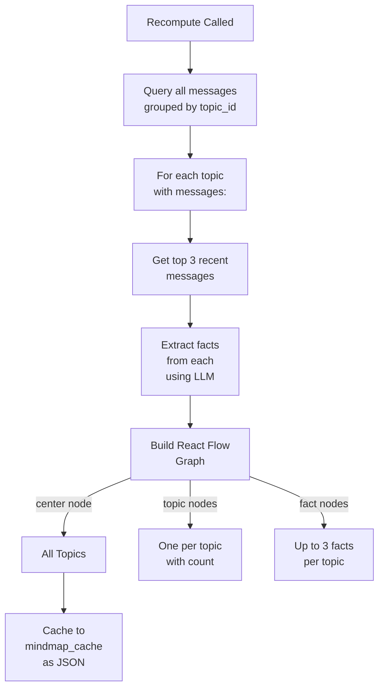
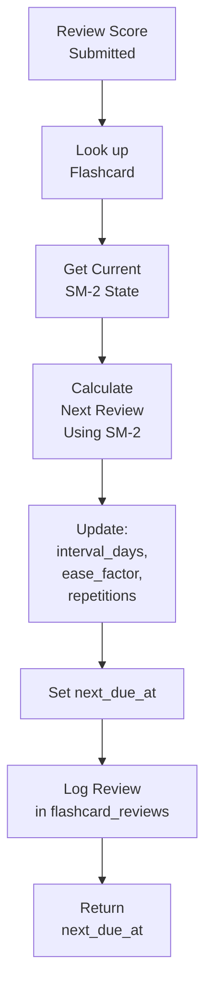
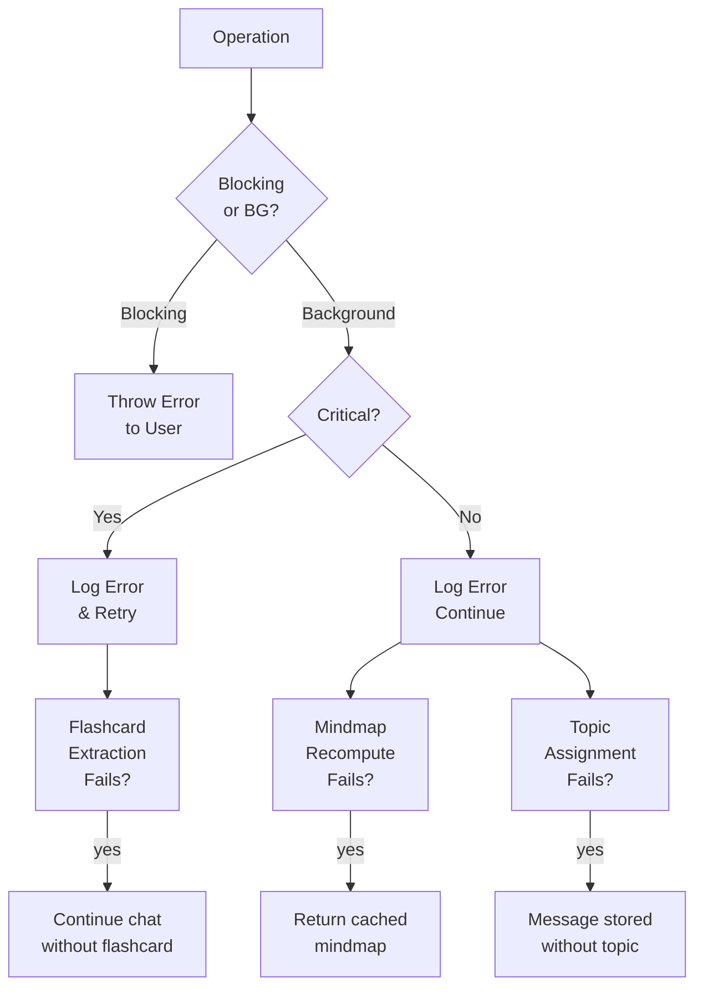
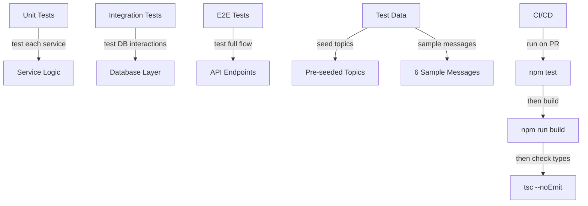

# System Architecture

Detailed architectural documentation for the TS-Agent system.

## High-Level System Architecture



## Runtime Flow: Detailed Sequence



## Message Lifecycle



## Component Details

### Topic Determiner Service (New)

Responsible for classifying messages into pre-seeded topics.



**Implementation**: `src/topic-determiner.ts` (to be created)

**Key Methods**:
- `determine(message: string): Promise<{ topicId: number; subtopic: string }>`
- `validateTopic(topicId: number): Promise<boolean>`

**Prompt Template**:
```
You have these 40 topics available:
[LIST OF TOPICS]

Classify this message into one of the above topics and provide a specific subtopic.

Message: [MESSAGE]

Respond as JSON: {
  "topicId": <number>,
  "topicLabel": "...",
  "subtopic": "..."
}
```

### Flashcard Extractor Service



**Current**: `src/flashcard-extractor.ts`

**Changes Required**:
- Instead of finding topic from mindmap, use message's `topic_id`
- Change `topic_label` column to `topic_id` (foreign key)

### Mindmap Service



**Current**: `src/mindmap.ts`

**Changes Required**:
- Replace k-means clustering with GROUP BY topic_id
- Simplify label generation (use topic_label from topics table)
- Add subtopic rendering to nodes

### Flashcard Service (SM-2 Algorithm)



**Current**: `src/flashcard-service.ts`

**No Changes Required** - this stays the same, just now uses `topic_id` instead of `topic_label`.

## Data Flow: Topic Assignment

### Before (Dynamic Clustering)
```
Message → Embedding → k-means Clustering → Dynamic Topic Label → Flashcard
                      ↓
                   Mindmap Cache (computed)
```

### After (Pre-seeded Topics)
```
Message → Store in DB → Topic Determiner (LLM) → topic_id FK → Flashcard
                        ↓
                     Update messages table
                        ↓
                   Mindmap Service queries by topic_id → Cache
```

## Database Changes

### New Table: topics

```sql
CREATE TABLE topics (
  id    BIGSERIAL PRIMARY KEY,
  label TEXT UNIQUE NOT NULL
);

-- Insert 40 pre-seeded topics
INSERT INTO topics (label) VALUES
  ('Fitness'), ('Cardio Training'), ('Strength Training'),
  ('Nutrition'), ('Sleep'), ('Yoga'), ('Meditation'),
  ('Finance'), ('Budgeting'), ('Saving'),
  ('Investing'), ('Debt Management'), ('Cryptocurrency'),
  ('Food'), ('Recipes'), ('Cooking'),
  ('Restaurants'), ('Diet'), ('Nutrition Tips'),
  ... (28 more topics)
```

### Modified: messages

```sql
ALTER TABLE messages ADD COLUMN topic_id BIGINT REFERENCES topics(id) ON DELETE SET NULL;
ALTER TABLE messages ADD COLUMN subtopic TEXT;
```

### Modified: flashcards

```sql
-- Change from topic_label to topic_id
ALTER TABLE flashcards DROP COLUMN topic_label;
ALTER TABLE flashcards ADD COLUMN topic_id BIGINT REFERENCES topics(id) ON DELETE SET NULL;
```

## API Changes

No changes to API routes, but response shapes expand:

**GET /history** now returns:
```json
{
  "id": 1,
  "role": "user",
  "content": "...",
  "topicId": 5,
  "subtopic": "cardio training",
  "createdAt": "..."
}
```

**GET /mindmap** nodes now include subtopic info:
```json
{
  "id": "topic-5",
  "type": "topic",
  "data": {
    "label": "Fitness",
    "subtopics": ["cardio training", "strength training"],
    "color": "#3b82f6"
  }
}
```

## Performance Characteristics

| Operation | Complexity | Notes |
|-----------|-----------|-------|
| Message Insert | O(1) | Single row insert |
| Topic Determination | O(1) | One LLM call (async) |
| Flashcard Extraction | O(n) | n = embeddings to compare (async) |
| Mindmap Recomputation | O(m log m) | m = messages, grouped by topic, cached |
| Vector Search | O(log n) | HNSW index on embeddings |
| Flashcard Review | O(1) | Single update |

**Key: All background operations are non-blocking and fire-and-forget**

## Error Handling Strategy



**Message Saving**: Always succeeds (blocking)
**Topic Assignment**: Fails gracefully, message still stored
**Flashcard Extraction**: Fails gracefully, chat continues
**Mindmap Recompute**: Returns cached version if fails

## Deployment Architecture

### Development
```
npm run dev
├── Vite dev server (frontend) :5173
└── ts-node api-server.ts (backend) :3000
```

### Production
```
npm run build
npm start
└── Single Express server serving compiled UI :3000
    └── Bundles UI dist/ui/index.html as static
```

### Database
- **Local Dev**: Docker PostgreSQL container
- **Staging/Prod**: Managed PostgreSQL (RDS, Heroku, etc.)
  - Must have pgvector extension enabled
  - Must have sufficient connection pool (20-50 depending on load)

## Scalability Considerations

### Read Scaling
- Message history: Limited to last N (default 50)
- Flashcards: Limited to due cards only
- Mindmap: Single cached copy, expires on recompute

### Write Scaling
- Flashcard writes: One per conversation turn (low volume)
- Message writes: One per conversation turn
- Topic assignments: Async, non-blocking
- Embeddings: One per unique message content

### Vector Search Scaling
- HNSW index handles ~1M vectors efficiently
- Cosine distance metric in production
- Background cleanup of old embeddings not implemented (TODO)

## Security Considerations

- **API Keys**: OPENAI_API_KEY in .env (not in repo)
- **Database**: Connection string in DATABASE_URL (not in repo)
- **User Data**: Messages stored in database, no encryption at rest
- **Rate Limiting**: Not implemented (add if exposing publicly)
- **Input Validation**: Basic string trimming only (add validation layer if needed)

## Testing Strategy



## Migration Path

1. **Phase 1**: Add topics table, seed 40 topics
2. **Phase 2**: Add topic_id + subtopic columns to messages
3. **Phase 3**: Create TopicDeterminer service
4. **Phase 4**: Update message processing to call TopicDeterminer
5. **Phase 5**: Update Mindmap to use topic_id instead of clustering
6. **Phase 6**: Update Flashcard to use topic_id FK instead of topic_label
7. **Phase 7**: Migrate existing flashcard_labels to topic_ids (if any)
8. **Phase 8**: Update UI to render subtopics in mindmap
